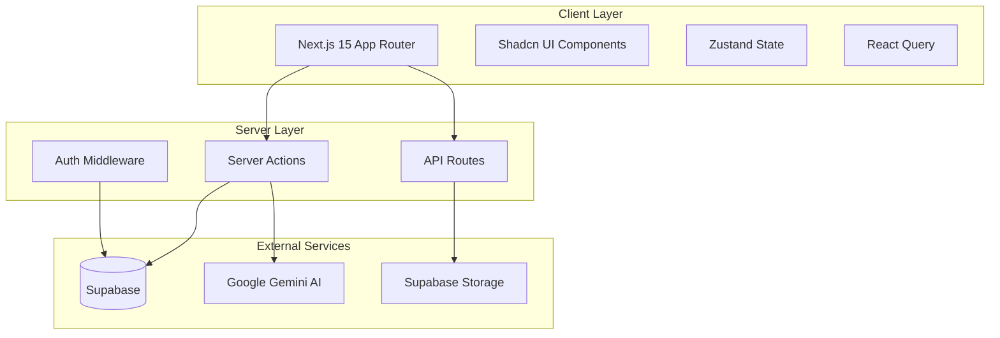
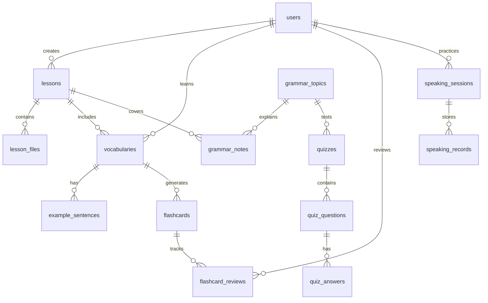
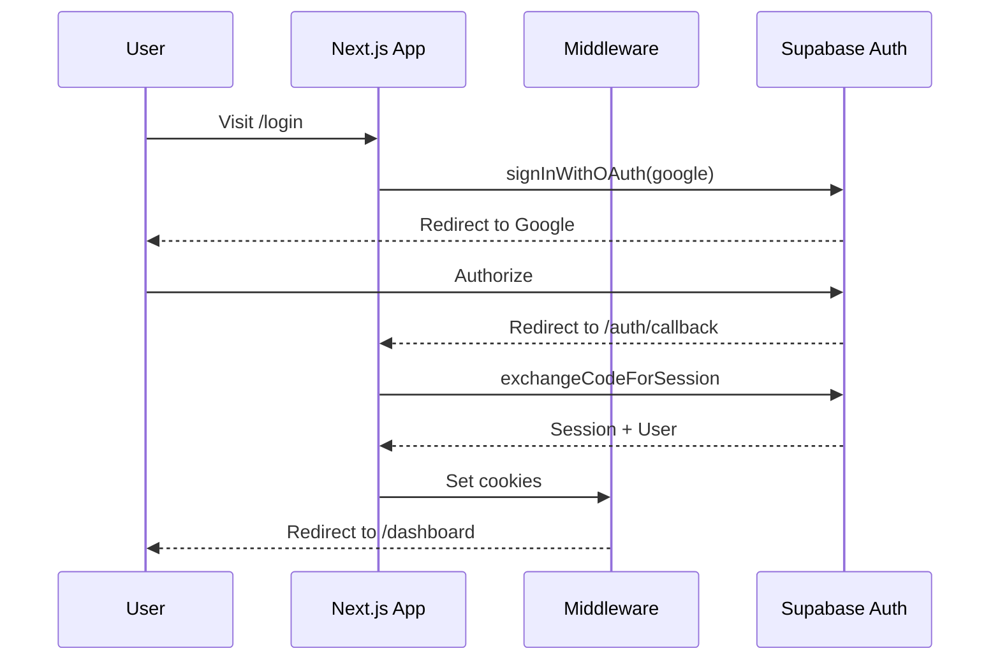
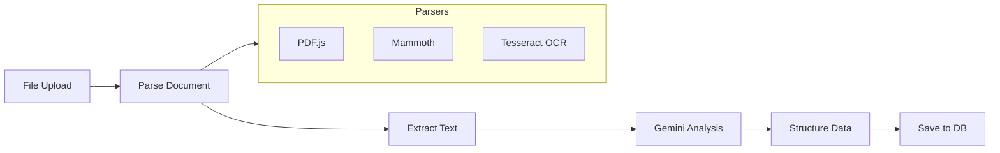
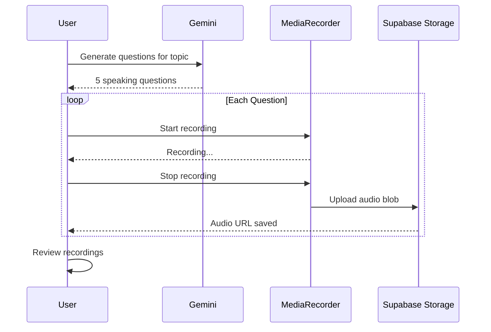

# English Learning Notebook - Implementation Plan

## Architecture Overview



---

## Phase 1: Foundation (Auth, Dashboard, Lesson, Vocabulary, Flashcard)

### 1.1 Project Setup

Create Next.js 15 project with TypeScript, TailwindCSS, and Shadcn UI:

```bash
npx create-next-app@latest . --typescript --tailwind --eslint --app --src-dir
npx shadcn@latest init
```

**Key dependencies:**
- `@supabase/supabase-js`, `@supabase/ssr` - Database and auth
- `@google/generative-ai` - Gemini AI
- `@tanstack/react-query` - Server state
- `zustand` - Client state
- `recharts` - Analytics charts
- `pdfjs-dist`, `mammoth` - Document parsing
- `zod` - Validation

**Project structure:**

```
src/
├── app/
│   ├── (auth)/login, register, callback
│   ├── (dashboard)/dashboard, lessons, vocabulary, flashcards, grammar, speaking, analytics
│   ├── api/
│   └── layout.tsx, page.tsx
├── components/
│   ├── ui/           # Shadcn components
│   ├── layout/       # Header, Sidebar, Footer
│   └── shared/       # Reusable components
├── features/
│   ├── auth/
│   ├── lessons/
│   ├── vocabulary/
│   ├── flashcards/
│   ├── grammar/
│   ├── speaking/
│   └── analytics/
├── lib/
│   ├── supabase/     # Client, server, middleware
│   ├── gemini/       # AI service
│   └── utils/
├── hooks/
├── stores/
└── types/
```

### 1.2 Database Schema

**Core tables with relationships:**



**Key tables:**

| Table | Key Fields |
|-------|------------|
| `users` | id, email, name, avatar_url, english_level (A1/A2/B1/B2), learning_goal, streak_count |
| `lessons` | id, user_id, title, description, date, tags[], status (draft/published/archived) |
| `lesson_files` | id, lesson_id, file_url, file_type, extracted_text, processing_status |
| `vocabularies` | id, user_id, lesson_id, word, meaning, ipa, part_of_speech, category, difficulty, is_learned, is_favorite |
| `example_sentences` | id, vocabulary_id, sentence, translation, difficulty, grammar_explanation |
| `flashcards` | id, vocabulary_id, user_id, front, back, mode (en_vi/vi_en/word_example/pronunciation) |
| `flashcard_reviews` | id, flashcard_id, ease_factor, interval, repetitions, next_review, last_review |
| `grammar_topics` | id, name, level, description, parent_id |
| `grammar_notes` | id, user_id, lesson_id, topic_id, explanation, examples[], notes |
| `quizzes` | id, user_id, lesson_id, grammar_topic_id, quiz_type, difficulty, score, completed_at |
| `quiz_questions` | id, quiz_id, question_type, content, correct_answer, explanation |
| `speaking_sessions` | id, user_id, lesson_id, topic, duration_seconds, questions[] |
| `speaking_records` | id, session_id, question_index, audio_url, duration |
| `learning_progress` | id, user_id, date, vocab_learned, vocab_reviewed, lessons_completed, quiz_score_avg, speaking_minutes |
| `streaks` | id, user_id, current_streak, longest_streak, last_activity_date |

### 1.3 Authentication Flow

Using Supabase Auth with Email, Google, and GitHub:



**Implementation files:**
- `src/lib/supabase/client.ts` - Browser client
- `src/lib/supabase/server.ts` - Server client
- `src/lib/supabase/middleware.ts` - Auth middleware
- `src/app/(auth)/login/page.tsx` - Login page with OAuth buttons
- `src/app/(auth)/callback/route.ts` - OAuth callback handler

### 1.4 Dashboard Module

**Components:**
- `StatsCards` - Total lessons, vocabulary, speaking sessions, streak
- `WeeklyProgress` - Bar chart of daily activity
- `TodayReview` - Vocabulary cards due for review
- `RecentLessons` - Last 5 lessons
- `QuickActions` - Add lesson, import file, start speaking

**Data fetching:** Server components with React Query for client-side updates.

### 1.5 Lesson Module

**Features:**
- CRUD operations via Server Actions
- Tag management with autocomplete
- File upload to Supabase Storage
- Status workflow (draft → published → archived)

**Key files:**
- `src/features/lessons/actions.ts` - Server actions
- `src/features/lessons/components/LessonForm.tsx`
- `src/features/lessons/components/LessonCard.tsx`
- `src/features/lessons/components/LessonList.tsx`

### 1.6 Vocabulary Module

**Features:**
- Search with debounce
- Filter by lesson, category, difficulty, learned status
- Favorite toggle
- Mark as learned
- Inline IPA pronunciation (Web Speech API)

**Key components:**
- `VocabularyTable` - Sortable, filterable table
- `VocabularyForm` - Add/edit vocabulary
- `VocabularyCard` - Card view with pronunciation

### 1.7 Flashcard Module

**SM-2 Algorithm Implementation:**

```typescript
interface ReviewResult {
  quality: 0 | 1 | 2 | 3 | 4 | 5; // 0-2: fail, 3-5: pass
}

function calculateNextReview(
  easeFactor: number,
  interval: number,
  repetitions: number,
  quality: number
): { easeFactor: number; interval: number; repetitions: number; nextReview: Date }
```

**Modes:**
- English → Vietnamese (front: word, back: meaning)
- Vietnamese → English (front: meaning, back: word)
- Word → Example (front: word, back: example sentence)
- Pronunciation (front: word, back: IPA + audio)

**UI:** Swipeable cards with keyboard shortcuts (1-4 for Again/Hard/Good/Easy)

---

## Phase 2: AI Features (Document Import, Extraction, Sentence Generator)

### 2.1 Document Import Pipeline



**File processing:**
- PDF: `pdfjs-dist` for text extraction
- DOCX: `mammoth` for HTML/text conversion
- PPTX: `pptx2json` or unzip + parse XML
- Images: `tesseract.js` for OCR
- TXT: Direct read

**API route:** `src/app/api/import/route.ts` - Handles file upload, parsing, AI extraction

### 2.2 Gemini AI Service

**Service structure (`src/lib/gemini/`):**

```typescript
// gemini-client.ts
const genAI = new GoogleGenerativeAI(process.env.GEMINI_API_KEY!);
const model = genAI.getGenerativeModel({ model: "gemini-1.5-flash" });

// extractors/lesson-extractor.ts
export async function extractLessonContent(text: string): Promise<{
  title: string;
  vocabulary: VocabularyItem[];
  grammar: GrammarTopic[];
  exercises: Exercise[];
}>

// generators/sentence-generator.ts
export async function generateSentences(word: string, meaning: string): Promise<{
  easy: { sentence: string; translation: string };
  medium: { sentence: string; translation: string };
  hard: { sentence: string; translation: string; grammarExplanation: string };
}>

// generators/quiz-generator.ts
export async function generateQuiz(topic: string, difficulty: string): Promise<Quiz>
```

**Prompt engineering:** Vietnamese-aware prompts with structured JSON output for reliable parsing.

### 2.3 Grammar Notebook

**Features:**
- Hierarchical topic tree (e.g., Tenses → Present → Present Simple)
- Rich text notes with examples
- Link to related vocabulary
- Search across all notes

---

## Phase 3: Speaking & Quizzes

### 3.1 Speaking Practice Module

**Flow:**



**Implementation:**
- `useMediaRecorder` hook for audio capture
- Audio visualization with Web Audio API
- Storage in Supabase Storage bucket `speaking-recordings`
- Playback with custom audio player

### 3.2 Quiz Generator

**Quiz types:**
- Multiple choice (4 options)
- Fill in the blank (input field)
- Sentence correction (identify and fix error)

**Generation prompt includes:**
- Lesson context
- Grammar topic
- Difficulty level
- User's English level

---

## Phase 4: Analytics & Polish

### 4.1 Learning Analytics

**Metrics tracked:**
- Daily vocabulary learned/reviewed
- Quiz scores over time
- Speaking practice duration
- Streak maintenance
- Retention rate (correct reviews / total reviews)

**Charts (Recharts):**
- Line chart: Progress over time
- Bar chart: Weekly activity
- Pie chart: Vocabulary by category
- Heatmap: Activity calendar

### 4.2 Review Schedule

**Spaced repetition dashboard:**
- Cards due today
- Cards overdue
- Upcoming reviews (next 7 days)
- Review statistics

### 4.3 UI Polish

**Design system:**
- Dark/Light mode with `next-themes`
- Consistent spacing scale (4px base)
- Color palette: Primary (blue), Success (green), Warning (amber), Error (red)
- Typography: Inter for UI, monospace for code/IPA

**Animations:**
- Page transitions with Framer Motion
- Card flip animation for flashcards
- Progress indicators
- Skeleton loaders

---

## Deployment

### Docker Configuration

```dockerfile
# Dockerfile
FROM node:20-alpine AS builder
WORKDIR /app
COPY package*.json ./
RUN npm ci
COPY . .
RUN npm run build

FROM node:20-alpine AS runner
WORKDIR /app
COPY --from=builder /app/.next/standalone ./
COPY --from=builder /app/.next/static ./.next/static
COPY --from=builder /app/public ./public
EXPOSE 3000
CMD ["node", "server.js"]
```

```yaml
# docker-compose.yml
services:
  app:
    build: .
    ports:
      - "3000:3000"
    environment:
      - NEXT_PUBLIC_SUPABASE_URL
      - NEXT_PUBLIC_SUPABASE_ANON_KEY
      - SUPABASE_SERVICE_ROLE_KEY
      - GEMINI_API_KEY
```

### Environment Variables

```
NEXT_PUBLIC_SUPABASE_URL=
NEXT_PUBLIC_SUPABASE_ANON_KEY=
SUPABASE_SERVICE_ROLE_KEY=
GEMINI_API_KEY=
```

---

## Testing Strategy

- **Unit tests:** Vitest for utilities, SM-2 algorithm, AI prompt functions
- **Component tests:** React Testing Library for UI components
- **E2E tests:** Playwright for critical flows (auth, flashcard review, import)
- **API tests:** Supertest for API routes

---

## File Deliverables Summary

| Category | Files |
|----------|-------|
| Config | `package.json`, `tsconfig.json`, `tailwind.config.ts`, `.env.example`, `Dockerfile`, `docker-compose.yml` |
| Database | `supabase/migrations/*.sql`, `supabase/seed.sql` |
| Auth | `middleware.ts`, `src/lib/supabase/*`, `src/app/(auth)/*` |
| Features | `src/features/{lessons,vocabulary,flashcards,grammar,speaking,analytics}/*` |
| AI | `src/lib/gemini/*` |
| Components | `src/components/{ui,layout,shared}/*` |
| Tests | `__tests__/*`, `e2e/*` |
| Docs | `README.md` |
